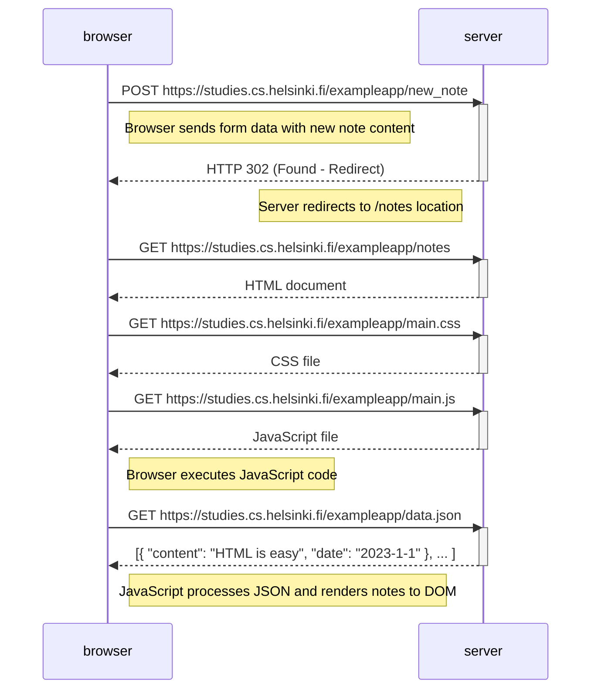

# 📄 Exercise 0.4: Sequence Diagram - New Note in Traditional Web Application

## 📋 Overview

This document presents a comprehensive sequence diagram illustrating the complete communication flow between the browser and server when a user creates a new note in the traditional web application (https://studies.cs.helsinki.fi/exampleapp/notes). This architectural model exemplifies the classical server-side rendering approach, characterized by full page reloads following each user interaction.

The analysis demonstrates the fundamental differences between traditional web applications and modern Single Page Applications (SPAs), particularly in terms of network efficiency, user experience, and the distribution of computational responsibilities between client and server.

---

## 📊 Sequence Diagram



---

## 🔍 Detailed Flow Analysis

### 1️⃣ Form Submission Phase
When the user completes the note input form and activates the submit button, the browser initiates an **HTTP POST request** to the `/new_note` endpoint. The request payload contains the form data encoded in `application/x-www-form-urlencoded` format, which is the default content type for HTML form submissions. This format represents key-value pairs separated by ampersands, with special characters URL-encoded.

The POST method is semantically appropriate here as it indicates a non-idempotent operation that creates a new resource on the server. According to HTTP specifications, POST requests should be used when the operation causes side effects or state changes on the server.

### 2️⃣ Server-Side Processing
Upon receiving the POST request, the server performs several critical operations:
- **Data validation**: Ensures the submitted data meets expected format and constraints
- **Business logic execution**: Processes the note content according to application rules
- **Data persistence**: Stores the new note in the database or data store
- **Response generation**: Constructs an HTTP 302 redirect response

The server responds with status code **HTTP 302 (Found)**, a redirection status indicating that the resource temporarily resides at a different URI. The `Location` header in the response specifies the target URL (`/notes`), instructing the browser where to navigate next.

### 3️⃣ Post-Redirect-Get Pattern
The browser automatically follows the 302 redirect by issuing a new **HTTP GET request** to `/notes`. This implements the Post-Redirect-Get (PRG) pattern, a web development design pattern that prevents duplicate form submissions when users refresh the page. By redirecting after a POST, the browser's location bar displays the GET URL, and refreshing the page will safely repeat the GET request rather than resubmitting the form.

This architectural decision prioritizes data integrity and user experience over network efficiency.

### 4️⃣ Static Resource Acquisition
The complete page reload necessitates re-downloading all static resources required for rendering:

**HTML Document**: The server generates a new HTML document that includes:
- Document structure and semantic markup
- References to external CSS and JavaScript files
- Inline content and metadata
- The updated count of notes (dynamically generated server-side)

**CSS Stylesheet (main.css)**: Contains the cascading style rules that define:
- Visual presentation and layout
- Responsive design breakpoints
- Color schemes and typography
- Component-specific styling

**JavaScript Code (main.js)**: Implements client-side functionality including:
- DOM manipulation logic
- Event handlers
- AJAX request initialization
- Data rendering algorithms

### 5️⃣ Asynchronous Data Retrieval
Once the JavaScript file loads and executes, it initiates an asynchronous **HTTP GET request** to `/data.json`. This represents the hybrid nature of this application—while primarily traditional in architecture, it incorporates AJAX techniques for data fetching.

The XMLHttpRequest API establishes a non-blocking connection to the server, requesting the complete dataset of notes. This asynchronous operation allows the page to remain responsive during data transfer, though in this traditional model, the page has just finished loading, minimizing the practical benefit.

### 6️⃣ Client-Side Rendering
Upon receiving the JSON response containing the array of note objects, JavaScript processes the data through the following steps:

1. **JSON Parsing**: Converts the JSON string into JavaScript objects using `JSON.parse()`
2. **DOM Manipulation**: Creates HTML elements programmatically for each note
3. **Element Construction**: Builds `<ul>` and `<li>` elements using `document.createElement()`
4. **Content Population**: Adds text nodes with note content using `createTextNode()`
5. **DOM Injection**: Appends the constructed elements to the existing DOM tree

This client-side rendering approach, despite being part of a traditional application, demonstrates early adoption of techniques that would become fundamental to SPA architectures.

---

## 📚 Technical Analysis

### ⚙️ Traditional Web Application Architecture
This application exemplifies the classical multi-page application (MPA) architecture where:

**Server Responsibilities**:
- Complete HTML generation
- Session management
- Business logic execution
- Data persistence
- Routing and navigation control

**Client Responsibilities**:
- HTML rendering
- CSS interpretation
- JavaScript execution
- User input capture
- Display updates

The server maintains authoritative control over application state and logic, with the browser serving primarily as a presentation layer. This architecture dominated web development prior to the widespread adoption of JavaScript frameworks and the emergence of SPA paradigms.

### 🔄 HTTP 302 Redirect Mechanism
The **302 (Found)** status code is a member of the 3xx class of redirection responses. Key characteristics include:

- **Temporary nature**: Indicates the requested resource temporarily resides at the Location header URI
- **Method preservation**: Technically should preserve the request method, though many implementations change POST to GET
- **Cache behavior**: Should not be cached by default
- **Browser handling**: Automatically followed by browsers without user intervention

The redirect serves multiple purposes:
1. Implements the PRG pattern for duplicate submission prevention
2. Provides a clean, bookmarkable URL after form submission
3. Separates data modification (POST) from data retrieval (GET)
4. Maintains RESTful principles by using appropriate HTTP semantics

### ⚠️ Performance and Efficiency Considerations
Analysis of the request sequence reveals significant inefficiencies:

**Network Overhead**:
- **5 sequential HTTP requests** required for a single user action
- **Redundant downloads** of unchanged static resources (CSS, JavaScript)
- **Increased latency** from multiple round-trips
- **Higher bandwidth consumption** compared to SPA approaches

**User Experience Impact**:
- **Page flashing**: Complete reload causes visual disruption
- **State loss**: Client-side state must be reconstructed
- **Perceived slowness**: User must wait for entire page reconstruction
- **Navigation interruption**: Scroll position and focus are reset

**Caching Opportunities**:
Modern browsers implement sophisticated caching mechanisms that can mitigate some inefficiencies:
- Static resources may be cached (if proper headers are set)
- HTTP/2 multiplexing can parallelize requests
- Service Workers could intercept and cache responses (in modern implementations)

However, the fundamental architectural limitation remains—the application doesn't leverage these optimizations effectively.

### 📦 Form Data Encoding
The `application/x-www-form-urlencoded` format is the default encoding for HTML forms:

**Structure**:
```
fieldname1=value1&fieldname2=value2
```

**Characteristics**:
- URL-safe encoding using percent-encoding
- Simple key-value pair structure
- Limited type support (all values treated as strings)
- Inefficient for complex or binary data
- Widely supported across all browsers and servers

**Comparison with JSON**:
| Feature | URL-encoded | JSON |
|---------|-------------|------|
| Type support | Strings only | Rich type system |
| Nested structures | Complex | Native support |
| Array representation | Limited | Full support |
| Parsing | Built-in (server) | Requires parsing |
| Size efficiency | Lower | Higher |

Modern applications increasingly favor JSON for its expressiveness and JavaScript compatibility.

### 🔌 Hybrid AJAX Implementation
The application demonstrates a transitional architectural approach:

**Traditional Elements**:
- Server-side HTML generation
- Form-based data submission
- Full page reloads
- Server-side routing

**Modern Elements**:
- AJAX data fetching
- Client-side rendering
- JSON data format
- Asynchronous operations

This hybrid model represents a common evolutionary step in web application development, incorporating newer techniques while maintaining a traditional foundation. It provides a learning opportunity to understand both paradigms and their respective trade-offs.

### 🌐 HTTP Protocol Considerations
The sequence demonstrates several HTTP protocol features:

**Request Methods**:
- **POST**: Creates new resources, non-idempotent
- **GET**: Retrieves resources, idempotent and safe

**Status Codes**:
- **200 OK**: Successful resource retrieval
- **302 Found**: Temporary redirect

**Headers**:
- **Content-Type**: Specifies payload format
- **Location**: Redirect target in 302 responses
- **Cache-Control**: Caching directives
- **Accept**: Client's acceptable response formats

Understanding these protocol elements is fundamental to web development and debugging network issues.

---

## 🛠️ Technologies and Standards

### Core Web Technologies
- **HTTP/1.1**: Application layer protocol for distributed hypermedia systems
- **HTML5**: Markup language defining document structure and semantics
- **CSS3**: Style sheet language for presentation and layout
- **JavaScript (ES5/ES6)**: Programming language for client-side logic

### APIs and Interfaces
- **XMLHttpRequest**: API for asynchronous HTTP communication
- **DOM API**: Interface for programmatic document manipulation
- **FormData API**: Interface for constructing form data programmatically
- **JSON**: JavaScript Object Notation for data interchange

### Architectural Patterns
- **Post-Redirect-Get (PRG)**: Prevents duplicate form submissions
- **Model-View-Controller (MVC)**: Separates concerns in application design
- **Asynchronous JavaScript and XML (AJAX)**: Enables partial page updates

### Development Tools
- **Browser DevTools**: Network tab for request inspection
- **Mermaid**: Text-based diagramming tool
- **HTTP inspection tools**: For analyzing request/response cycles

---

## 🎓 Learning Outcomes

This exercise demonstrates:
1. Complete understanding of traditional web application request/response cycles
2. Recognition of inefficiencies in classical architectures
3. Appreciation for the evolution toward SPA architectures
4. Practical knowledge of HTTP protocol mechanics
5. Foundation for comparing traditional vs. modern approaches
