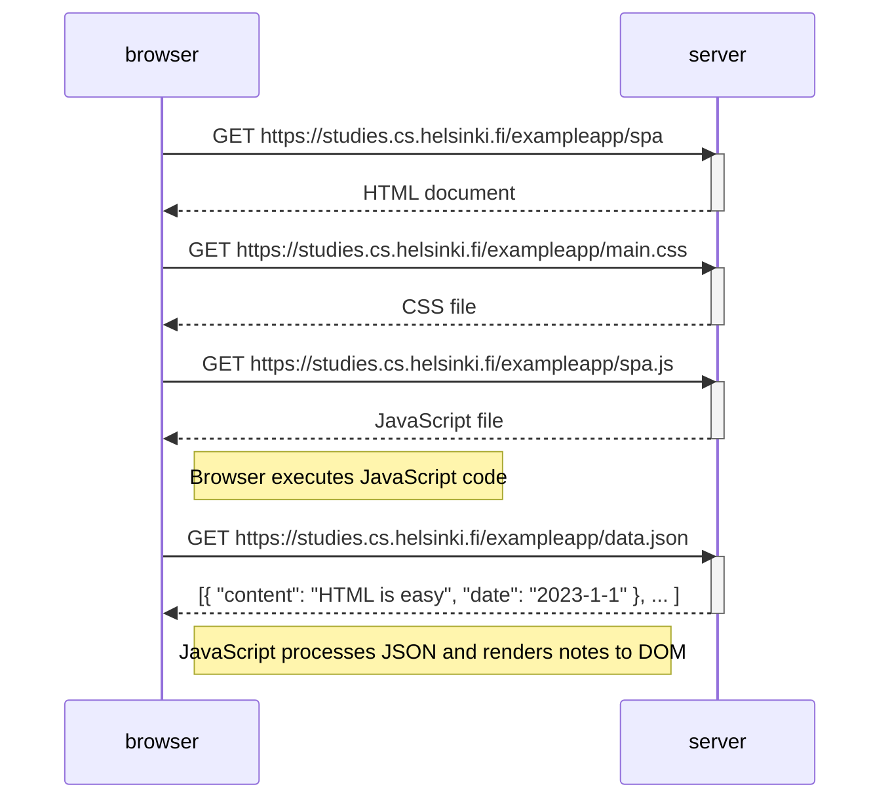

# 📄 Exercise 0.5: Sequence Diagram - Single Page Application Initial Load

## 📋 Overview

This diagram maps out what happens when you first visit the SPA version of the application at https://studies.cs.helsinki.fi/exampleapp/spa. Unlike traditional web apps that reload the entire page with every interaction, SPAs load once and then dynamically update content as needed.

This architectural shift moves most of the rendering logic from the server to the browser, fundamentally changing how we think about building web applications. Understanding this flow is essential for working with modern frameworks like React, Vue, or Angular.

---

## 📊 Sequence Diagram



---

## 🔍 Flow Breakdown

### 1️⃣ Initial HTML Request
When you navigate to the SPA URL, your browser fires off an **HTTP GET request** to `/spa`. The server responds with a minimal HTML document—just the skeleton of the app. 

This HTML is drastically different from what a traditional app returns. Instead of a fully-populated page with content, you get:
- Basic document structure (DOCTYPE, html, head, body tags)
- Links to external CSS and JavaScript files
- Empty container elements that JavaScript will fill later
- Maybe some meta tags and configuration

Think of it as a empty frame that JavaScript will paint later. The HTML by itself doesn't show any notes or meaningful content—it's just waiting for JavaScript to bring it to life.

### 2️⃣ CSS Download
The browser parses the HTML and spots a `<link>` tag pointing to `main.css`. It immediately requests this stylesheet via **HTTP GET**.

CSS is render-blocking by default, meaning the browser won't fully render the page until it has the styles. This makes sense—you don't want users seeing unstyled content flash before their eyes. The browser constructs the CSSOM (CSS Object Model) from these rules, which it'll later combine with the DOM to figure out what to actually draw on screen.

The CSS file contains all the visual rules for the entire application: layouts, colors, typography, responsive breakpoints, animations—everything needed to make the app look right.

### 3️⃣ JavaScript Download
Right after (or sometimes in parallel with) the CSS request, the browser fetches `/spa.js` via another **HTTP GET**.

Notice the filename: `spa.js`, not `main.js` like in the traditional version. This isn't just a naming convention—this file contains completely different logic. Instead of just fetching data and rendering it once, `spa.js` includes:
- Application initialization code
- Event handlers for user interactions
- Routing logic (handling different "pages" without server requests)
- State management
- Functions to render and update the UI dynamically

This JavaScript file is the heart of the SPA. It's what makes everything interactive and responsive without page reloads.

### 4️⃣ JavaScript Execution
Once downloaded, the browser's JavaScript engine parses and executes the code. This is where things get interesting.

The code typically does several things during initialization:
1. Sets up event listeners (for form submissions, button clicks, etc.)
2. Initializes any application state
3. Configures client-side routing if needed
4. Kicks off data fetching

In our example, the JavaScript registers handlers for form submission and immediately makes an AJAX request to get the notes data. The app is now "alive"—it's ready to respond to user actions and will handle everything client-side from here on out.

### 5️⃣ Asynchronous Data Fetch
As part of initialization, JavaScript makes an **asynchronous HTTP GET request** to `/data.json`. This is an AJAX call—the page doesn't freeze or reload while waiting for the response.

The request happens in the background using either XMLHttpRequest (older API) or fetch (modern API). The browser continues executing code and remains responsive while waiting. This is a huge UX improvement over traditional apps where the entire page locks up during server communication.

The server responds with a JSON array containing all the notes. JSON is perfect here because it maps directly to JavaScript objects—no parsing HTML or extracting data from markup.

### 6️⃣ Client-Side Rendering
Once the JSON arrives, JavaScript takes over and builds the UI:

1. **Parse the JSON**: Convert the JSON string into JavaScript objects
2. **Loop through the data**: Iterate over each note in the array
3. **Create DOM elements**: Programmatically build `<ul>` and `<li>` elements
4. **Populate content**: Add text nodes with note content
5. **Insert into page**: Inject the created elements into the DOM

This all happens in the browser with no server involvement. The UI updates instantly, and the app is ready for interaction. If you submit a new note later, only the data will be sent to the server—the page itself stays put.

---

## 📚 Technical Deep Dive

### ⚙️ SPA Architecture Fundamentals

SPAs flip the traditional client-server model on its head. Instead of the server being responsible for generating HTML, it becomes a pure API that serves data. The browser takes on much more responsibility:

**Server's job**:
- Serve the initial HTML shell (once)
- Provide static assets (CSS, JS)
- Expose a JSON API for data
- Handle business logic and data persistence
- Manage authentication and authorization

**Browser's job**:
- Render the entire UI
- Handle routing and navigation
- Manage application state
- Process user interactions
- Make API calls for data
- Update the DOM dynamically

This separation creates a cleaner architecture. The frontend and backend can evolve independently, you can reuse the same API for mobile apps, and you can deploy them separately.

### 🚀 Why SPAs Feel Faster

Several factors contribute to the snappy feel of SPAs:

**No page reloads**: Every interaction in a traditional app triggers a full page reload—even clicking a link. SPAs eliminate this completely. Clicking around feels instant because you're just swapping out pieces of the DOM, not rebuilding the entire page.

**Efficient data transfer**: After the initial load, SPAs only transfer data, not markup. Instead of sending 50KB of HTML every time, you might send 2KB of JSON. Over a slow connection, this makes a massive difference.

**Aggressive caching**: Since the HTML, CSS, and JavaScript don't change often, browsers can cache them aggressively. On repeat visits, you might only need to fetch fresh data—everything else loads from cache.

**Perceived performance**: SPAs can show instant feedback for user actions before the server responds. Click a button? Update the UI immediately and sync with the server in the background. This makes apps feel responsive even on slow connections.

### ⚠️ SPA Challenges

SPAs aren't all sunshine and rainbows. They introduce several complications:

**SEO difficulties**: Search engine crawlers historically didn't execute JavaScript, meaning they'd see your empty HTML shell and miss all the content. Google's crawler now runs JavaScript, but it's inconsistent. Solutions include server-side rendering (SSR) or pre-rendering pages for crawlers.

**Initial load time**: You have to download the entire JavaScript bundle before the app becomes interactive. For large apps, this can mean several seconds of staring at a blank page. Code splitting helps, but it's an extra complexity you have to manage.

**State management complexity**: In traditional apps, the server handles state—reload the page, and the server sends fresh data. In SPAs, you manage state in the browser across multiple user actions. This gets complicated fast. Libraries like Redux exist precisely to tame this complexity.

**Browser history**: Browsers expect navigation to work with back/forward buttons. SPAs have to manually manage the browser history using the History API. Mess this up, and users get confused when the back button doesn't work as expected.

**Memory leaks**: Traditional apps reset with every page load. SPAs run continuously, and if you're not careful about cleaning up event listeners and references, memory usage can creep up over time.

**Accessibility**: Dynamic content updates need to be announced to screen readers using ARIA live regions. Focus management becomes your responsibility. It's easy to create an inaccessible mess if you're not careful.

### 📦 SPA vs Traditional: The Numbers

Looking at the actual requests helps clarify the differences:

| Metric | Traditional App | SPA |
|--------|----------------|-----|
| **Initial requests** | 5 (with form submit) | 4 |
| **HTML content** | Full markup with data | Minimal shell |
| **Subsequent navigation** | 5 new requests | 1 request (data only) |
| **Data transferred per action** | ~50KB (full HTML) | ~2KB (JSON only) |
| **Rendering** | Server generates HTML | Browser builds DOM |
| **State persistence** | Stored server-side | Managed client-side |
| **Back button** | Works automatically | Requires manual handling |
| **SEO** | Works out of box | Needs special handling |
| **Time to first paint** | Fast | Slower (JS must load) |
| **Time to interactive** | Slow (full reload) | Fast (after initial load) |

The sweet spot? After the initial load, SPAs are dramatically faster. But that initial load can be slower than a traditional app serving server-rendered HTML.

### 🔌 Modern SPA Ecosystem

Building SPAs in vanilla JavaScript works but gets messy fast. The ecosystem has evolved sophisticated tools:

**Frameworks**:
- **React**: Component-based UI library from Facebook. Huge ecosystem, massive community, tons of jobs.
- **Vue**: Progressive framework with excellent documentation. Easier learning curve than React.
- **Angular**: Full-featured framework from Google. Opinionated and TypeScript-first.
- **Svelte**: Compiler approach that eliminates runtime overhead. Generates optimized vanilla JS.

**State Management**:
- **Redux**: Predictable state container with actions and reducers. Verbose but powerful.
- **MobX**: Observable state with automatic reactivity. Less boilerplate than Redux.
- **Zustand**: Minimal state management with hooks. Simple but effective.
- **Recoil**: Facebook's answer to Redux, designed specifically for React.

**Routing**:
- **React Router**: De facto standard for React apps
- **Vue Router**: Official router for Vue
- **TanStack Router**: Type-safe routing for any framework

**Build Tools**:
- **Vite**: Modern build tool, crazy fast hot reloading
- **Webpack**: Mature, powerful, configurable bundler
- **Parcel**: Zero-config bundler for simpler projects
- **Turbopack**: Next-gen bundler from Vercel

### 🌐 HTTP Details Matter

Understanding what's happening at the HTTP level helps debug issues:

**Request sequence**:
```
1. GET /spa → HTML (text/html)
2. GET /main.css → CSS (text/css)  
3. GET /spa.js → JavaScript (application/javascript)
4. GET /data.json → JSON (application/json)
```

**Caching strategies**:
- Static assets (JS, CSS) can use long cache times with filename hashing
- HTML should not be cached (or cache briefly) so you can deploy updates
- JSON data typically shouldn't be cached, or cached very briefly

**Headers to watch**:
```
Cache-Control: public, max-age=31536000, immutable  (for hashed JS/CSS)
Cache-Control: no-cache  (for HTML)
ETag: "abc123"  (for conditional requests)
Content-Encoding: gzip  (compression)
```

**Performance optimizations**:
- **HTTP/2**: Multiplexes requests over one connection
- **Compression**: Gzip or Brotli reduces transfer size by 70-80%
- **Resource hints**: `<link rel="preload">` for critical resources
- **Service Workers**: Programmable network proxy for offline support

---

## 🛠️ Technologies Involved

### Core Web Platform
- **HTTP/1.1 or HTTP/2**: Network protocol
- **HTML5**: Document structure and semantics
- **CSS3**: Styling and layout
- **JavaScript (ES6+)**: Application logic
- **JSON**: Data format

### Browser APIs
- **XMLHttpRequest**: Legacy AJAX API
- **Fetch API**: Modern HTTP request API
- **DOM API**: Document manipulation
- **History API**: Browser navigation without reloads
- **Web Storage API**: localStorage, sessionStorage
- **Service Worker API**: Background scripts for offline support

### Development Tools
- **Browser DevTools**: Network tab, Console, Performance profiler
- **Mermaid**: Text-based diagram generation
- **Lighthouse**: Performance and accessibility auditing
- **React DevTools**: Component tree inspection
- **Redux DevTools**: State and action debugging

### Architectural Patterns
- **Single Page Application**: One-page app architecture
- **Component-Based Architecture**: UI as composable components
- **Unidirectional Data Flow**: Data flows one direction (like Flux/Redux)
- **Virtual DOM**: Efficient DOM updates through diffing
- **Reactive Programming**: UI automatically updates when data changes

---

## 🎓 Key Takeaways

Working through this exercise clarifies:

1. **Loading sequence**: How browsers fetch and process resources for SPAs
2. **Separation of concerns**: Static resources load once, data loads dynamically
3. **Client-side rendering**: JavaScript builds the UI rather than the server
4. **Async operations**: How AJAX enables non-blocking data fetching
5. **Modern web architecture**: Foundation for React, Vue, Angular, and other frameworks
6. **Performance trade-offs**: Initial load vs subsequent interactions
7. **Why frameworks exist**: Vanilla SPA code gets messy; frameworks add structure

---

## 📌 Key Differences from Exercise 0.4

The traditional app (0.4) made **5 requests** including a full page reload after submitting the form. The SPA makes **4 requests** on initial load, but here's the critical difference: subsequent interactions only transfer data.

Submit a new note in the traditional app? 5 more requests. Submit a note in the SPA? 1 request sending JSON, no reload. Navigate to a different section? Traditional app reloads everything; SPA just updates the relevant DOM nodes.

This is why SPAs dominate modern web development—after paying the upfront cost of loading JavaScript, every interaction is dramatically faster.

---

## 🔮 Evolution and Future

SPAs paved the way for:

**Progressive Web Apps (PWAs)**: Add offline support, push notifications, and installability to SPAs using Service Workers. They blur the line between web and native apps.

**Hybrid rendering**: Modern frameworks like Next.js and Nuxt combine server-side rendering for initial load (better SEO and performance) with SPA behavior for subsequent navigation.

**Islands architecture**: Rather than shipping one massive JavaScript bundle, identify interactive "islands" on the page and only hydrate those. The rest stays as static HTML.

**Edge rendering**: Move rendering to CDN edge servers for globally distributed, fast initial loads while maintaining SPA benefits.

The web platform keeps evolving, but understanding the core SPA pattern remains essential—it's the foundation everything else builds on.
