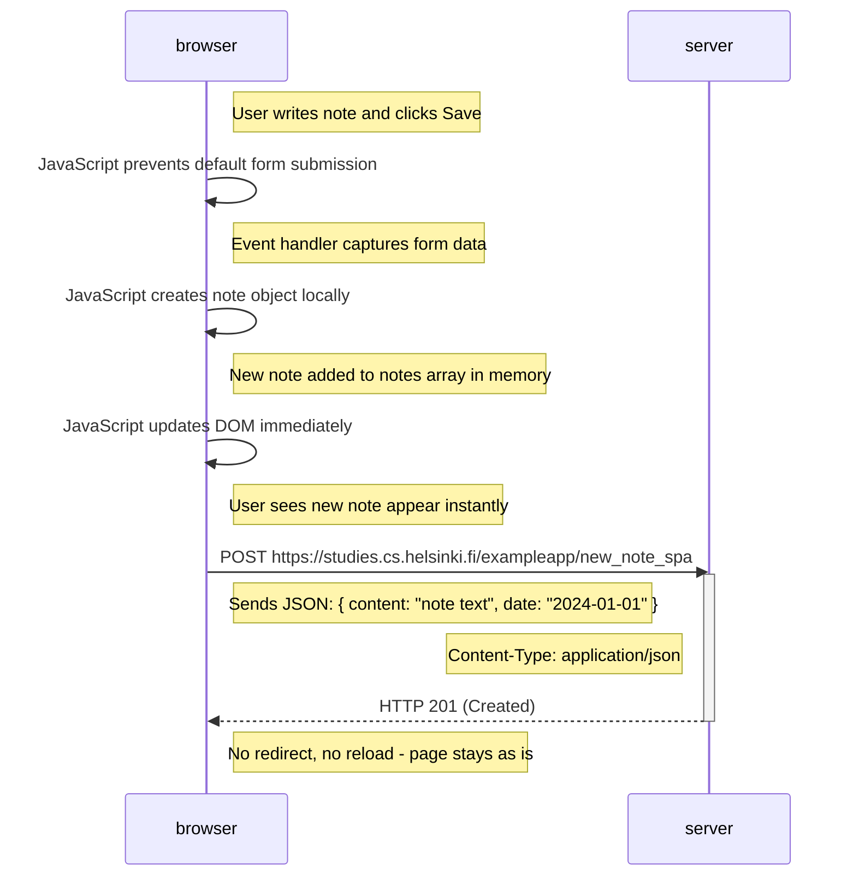

# 📄 Exercise 0.6: Sequence Diagram - Creating a New Note in SPA

## 📋 Overview

This diagram shows what happens when you create a new note in the SPA version of the application at https://studies.cs.helsinki.fi/exampleapp/spa. This is where SPAs really shine—the entire operation happens without reloading the page. No flash, no jarring transitions, just smooth, instant feedback.

Unlike the traditional app from exercise 0.4 (which made 5 requests and reloaded everything), the SPA approach makes a single request and updates only the parts of the page that need to change. This is the fundamental difference that makes modern web apps feel so much faster and more responsive.

---

## 📊 Sequence Diagram



---

## 🔍 Detailed Flow Analysis

### 1️⃣ User Interaction
The user types a note into the text input field and clicks the "Save" button. In a traditional app, this would trigger a standard HTML form submission that sends a POST request and reloads the page. But SPAs intercept this default behavior.

The form element in the HTML has no `action` or `method` attributes—this is intentional. Instead, JavaScript will handle everything:

```html
<form id="notes_form">
  <input type="text" name="note">
  <input type="submit" value="Save">
</form>
```

Without JavaScript, this form wouldn't work at all. That's a trade-off of SPAs—they depend entirely on JavaScript being enabled.

### 2️⃣ JavaScript Intercepts the Form Submission
When the user clicks "Save", the browser fires a `submit` event on the form. But before the browser can do its default behavior (send POST and reload), JavaScript jumps in:

```javascript
var form = document.getElementById('notes_form')
form.onsubmit = function(e) {
  e.preventDefault()  // Stop the default submission
  // ... handle everything manually
}
```

That `e.preventDefault()` call is crucial. It tells the browser: "Don't do what you normally do with forms. I'll handle this." Without it, the page would reload just like in the traditional app.

This is the first major difference from exercise 0.4. In the traditional app, the browser handles form submission automatically. Here, JavaScript takes complete control.

### 3️⃣ Creating the Note Object Locally
JavaScript extracts the text from the input field and constructs a note object:

```javascript
var note = {
  content: e.target.elements[0].value,
  date: new Date()
}
```

Notice that the date is generated client-side using `new Date()`. In the traditional app, the server created the timestamp. This shift of responsibility is typical in SPAs—things that don't require server authority happen in the browser.

The note object now exists in browser memory. At this point, it hasn't been sent to the server yet—it's purely client-side.

### 4️⃣ Updating the Local State
The new note gets added to an in-memory array that holds all the notes:

```javascript
notes.push(note)
```

This array is JavaScript's representation of the application state. In more complex apps, this might be managed by Redux, Zustand, or another state management library. Here, it's just a plain JavaScript array.

This is another key difference from traditional apps. In exercise 0.4, the server held the authoritative list of notes. The browser only saw them when the server sent the HTML. Here, the browser maintains its own copy of the notes and keeps it synchronized with the server.

### 5️⃣ Immediate DOM Update
Before even contacting the server, JavaScript updates the UI:

```javascript
redrawNotes()
```

This function rebuilds the notes list in the DOM, including the new note. The user sees their note appear immediately—no waiting for a server response, no page reload, no delay.

This is a huge UX win. From the user's perspective, the action is instant. Even on a slow connection, the note appears right away. This technique is called "optimistic updates"—you assume the server will succeed and update the UI immediately.

What if the server request fails? Good apps handle this by either:
- Showing an error and removing the note
- Keeping the note but marking it as "pending" or "failed"
- Retrying the request automatically

Our simple example doesn't handle failures, but production apps absolutely should.

### 6️⃣ Sending Data to Server
After updating the UI, JavaScript sends the note to the server:

```javascript
var xhttpForPost = new XMLHttpRequest()
xhttpForPost.open('POST', '/new_note_spa', true)
xhttpForPost.setRequestHeader('Content-type', 'application/json')
xhttpForPost.send(JSON.stringify(note))
```

Several important details here:

**Different endpoint**: The URL is `/new_note_spa`, not `/new_note` like the traditional app. The server needs a different endpoint because it's handling a different request format.

**JSON content type**: The `Content-Type` header is set to `application/json`. This tells the server "I'm sending JSON, not form data." The server will parse the body as JSON rather than as URL-encoded form data.

**JSON.stringify**: The note object gets serialized to a JSON string. Objects can't be sent over HTTP directly—they need to be converted to text first.

**Asynchronous**: The third parameter to `open()` is `true`, making this an async request. The page remains responsive while waiting for the response.

### 7️⃣ Server Processing
The server receives the POST request with JSON payload:

```json
{
  "content": "SPAs are cool",
  "date": "2024-01-01T10:30:00.000Z"
}
```

The server:
1. Parses the JSON
2. Validates the data
3. Stores the note (database, memory, etc.)
4. Responds with status **201 (Created)**

Notice there's no redirect. The server just confirms "I got it, thanks" with a 201 status code. That's all the browser needs.

Compare this to exercise 0.4, where the server responded with 302 redirect. That redirect triggered a full page reload. Here, there's no redirect, so nothing reloads.

### 8️⃣ No Page Reload
This is the critical moment: the browser receives the 201 response and... does nothing. The page stays exactly as it is. No reload, no redirect, no fetching new resources.

The user's experience is seamless. They typed a note, clicked save, saw it appear instantly, and kept working. They might not even realize a server request happened.

This is the power of SPAs. The page never reloads after the initial load. Every interaction updates just the necessary parts of the DOM.

---

## 📚 Technical Deep Dive

### ⚙️ The Event Handler Pattern

Controlling form submission through JavaScript is a fundamental SPA technique. Let's break down the complete event handler:

```javascript
var form = document.getElementById('notes_form')
form.onsubmit = function(e) {
  // Step 1: Prevent default behavior
  e.preventDefault()
  
  // Step 2: Extract form data
  var note = {
    content: e.target.elements[0].value,
    date: new Date()
  }
  
  // Step 3: Update local state
  notes.push(note)
  
  // Step 4: Clear the input
  e.target.elements[0].value = ''
  
  // Step 5: Update UI
  redrawNotes()
  
  // Step 6: Sync with server
  sendToServer(note)
}
```

This pattern appears everywhere in SPAs:
1. Intercept a browser event
2. Prevent default behavior
3. Update application state
4. Re-render affected UI
5. Sync with server asynchronously

Modern frameworks like React abstract this pattern away. You write declarative code describing what the UI should look like, and the framework handles the event management and DOM updates. But underneath, this is what's happening.

### 🔄 Optimistic Updates vs Pessimistic Updates

Our SPA uses **optimistic updates**—it updates the UI immediately, assuming the server request will succeed. This makes the app feel instant.

The alternative is **pessimistic updates**: wait for the server response before updating the UI. This is more reliable but feels slower:

```javascript
// Pessimistic approach
sendToServer(note, function(response) {
  if (response.ok) {
    notes.push(note)
    redrawNotes()
  } else {
    showError("Failed to save note")
  }
})
```

Trade-offs:

**Optimistic updates**:
- ✅ Instant feedback
- ✅ Works offline (can queue requests)
- ✅ Better perceived performance
- ❌ Can show inconsistent state if server fails
- ❌ Need to handle rollbacks on errors

**Pessimistic updates**:
- ✅ Always shows accurate server state
- ✅ Simpler error handling
- ✅ No need for rollback logic
- ❌ Feels slower
- ❌ Users wait for network round-trips

Most modern apps use optimistic updates with proper error handling. The instant feedback is worth the extra complexity.

### 📦 JSON vs Form Data: A Comparison

The traditional app (exercise 0.4) sent form data as `application/x-www-form-urlencoded`:
```
note=This+is+my+note&date=2024-01-01
```

The SPA sends JSON with `application/json`:
```json
{
  "content": "This is my note",
  "date": "2024-01-01T10:30:00.000Z"
}
```

Why the difference?

**Form-encoded data**:
```
field1=value1&field2=value2&field3=value3
```

**Advantages**:
- Simple, flat structure
- Native browser support
- Works without JavaScript
- Widely supported

**Limitations**:
- Only strings (no numbers, booleans, null)
- Awkward handling of arrays: `items[]=a&items[]=b`
- No nested objects
- Spaces become `+`, special chars need encoding

**JSON**:
```json
{
  "field1": "value1",
  "field2": 42,
  "field3": true,
  "nested": {
    "field4": ["a", "b", "c"]
  }
}
```

**Advantages**:
- Rich type system (strings, numbers, booleans, null, arrays, objects)
- Native JavaScript support
- Clean nested structures
- Better for complex data

**Limitations**:
- Requires JavaScript to construct
- Slightly larger than form-encoding (because of quotes and braces)
- Not supported by standard HTML forms

For SPAs, JSON is the obvious choice. It matches JavaScript's native data structures perfectly, and since you're already using JavaScript to handle submission, there's no downside.

### 🌐 HTTP Status Codes in Detail

The server responds with **201 (Created)**, which is semantically correct for creating a new resource. Let's compare with other codes:

**200 (OK)**:
- Generic success
- Could be used here, but less precise
- "The request succeeded"

**201 (Created)**:
- Specific success for resource creation
- More semantic
- "A new resource was created"
- Should include `Location` header with new resource URL (our example doesn't, but proper RESTful APIs would)

**204 (No Content)**:
- Success with no response body
- Could work here if the server doesn't return the created note
- "Success, but I have nothing to send back"

**302 (Found)**:
- What the traditional app used
- Means "go look somewhere else"
- Triggers a redirect
- Wrong for an API—we don't want redirects in SPAs

Proper use of status codes helps with debugging and makes APIs more predictable. A well-designed API uses:
- **2xx** for success
- **4xx** for client errors (bad request, not found, unauthorized)
- **5xx** for server errors (internal error, service unavailable)

### 🔌 XMLHttpRequest vs Fetch API

The example uses XMLHttpRequest, which is the older API. Modern code typically uses the Fetch API instead:

**XMLHttpRequest (what the example uses)**:
```javascript
var xhr = new XMLHttpRequest()
xhr.onreadystatechange = function() {
  if (this.readyState == 4 && this.status == 200) {
    // Handle response
  }
}
xhr.open('POST', '/new_note_spa', true)
xhr.setRequestHeader('Content-Type', 'application/json')
xhr.send(JSON.stringify(note))
```

**Fetch API (modern approach)**:
```javascript
fetch('/new_note_spa', {
  method: 'POST',
  headers: {
    'Content-Type': 'application/json'
  },
  body: JSON.stringify(note)
})
.then(response => {
  if (!response.ok) throw new Error('Failed')
  return response.json()
})
.then(data => {
  console.log('Success:', data)
})
.catch(error => {
  console.error('Error:', error)
})
```

Or with async/await (even cleaner):
```javascript
try {
  const response = await fetch('/new_note_spa', {
    method: 'POST',
    headers: {
      'Content-Type': 'application/json'
    },
    body: JSON.stringify(note)
  })
  
  if (!response.ok) throw new Error('Failed')
  const data = await response.json()
  console.log('Success:', data)
} catch (error) {
  console.error('Error:', error)
}
```

**Why Fetch is better**:
- Promise-based (works with async/await)
- Cleaner, more readable syntax
- Better error handling
- Supports streaming responses
- Actively maintained and improved

**Why XMLHttpRequest still exists**:
- Legacy code and tutorials
- More browser support (works in IE)
- Some edge cases Fetch doesn't handle well
- Progress events for uploads (Fetch is getting this)

For new code, use Fetch. The example uses XMLHttpRequest to match the rest of the course materials.

### ⚡ Client-Side State Management

The SPA maintains state in the `notes` array. This is simple but has limitations. As apps grow, state management gets complex fast:

**Simple array (this example)**:
```javascript
var notes = []
notes.push(newNote)
```

**Problems with simple state**:
- Hard to track what changed
- No way to undo/redo
- Difficult to debug
- Can't easily sync across components
- No subscriptions to changes

**Redux approach**:
```javascript
// Define actions
const ADD_NOTE = 'ADD_NOTE'

// Action creator
function addNote(content) {
  return {
    type: ADD_NOTE,
    payload: { content, date: new Date() }
  }
}

// Reducer
function notesReducer(state = [], action) {
  switch (action.type) {
    case ADD_NOTE:
      return [...state, action.payload]
    default:
      return state
  }
}

// Dispatch action
store.dispatch(addNote("My note"))
```

Redux adds structure:
- **Actions**: Plain objects describing what happened
- **Reducers**: Pure functions that update state
- **Store**: Single source of truth
- **Subscriptions**: Components re-render when state changes
- **Middleware**: Intercept actions for logging, async, etc.
- **DevTools**: Time-travel debugging

For a notes app, Redux is overkill. But for a large app with complex state, it prevents chaos.

**Modern alternatives**:
- **Context API** (React): Built-in, simpler than Redux
- **Zustand**: Minimal state management with hooks
- **Jotai**: Atomic state management
- **MobX**: Observable state with automatic reactivity
- **XState**: State machines for complex flows

### 🎯 Comparing Traditional vs SPA: The Complete Picture

Let's map out both flows side by side:

**Traditional App (Exercise 0.4)**:
```
1. User submits form
2. Browser sends POST with form data
3. Server processes, stores note
4. Server sends 302 redirect
5. Browser follows redirect (GET /notes)
6. Server generates full HTML
7. Browser receives HTML
8. Browser requests CSS
9. Browser requests JavaScript
10. Browser requests JSON data
11. JavaScript renders notes
Total: 5 requests, full reload, user sees flash
```

**SPA (Exercise 0.6)**:
```
1. User submits form
2. JavaScript prevents default
3. JavaScript adds note to local array
4. JavaScript updates DOM
5. User sees note instantly
6. JavaScript sends POST with JSON
7. Server stores note
8. Server sends 201 Created
Total: 1 request, no reload, instant feedback
```

The numbers tell the story:
- **Requests**: 5 vs 1
- **Data transferred**: ~50KB vs ~2KB
- **User wait time**: 2-3 seconds vs instant
- **Page reload**: Yes vs No
- **State maintained**: Lost vs Preserved

This is why SPAs won. After the initial load cost, every subsequent interaction is dramatically faster.

### 🔐 Security Considerations

SPAs introduce some security concerns that traditional apps handle differently:

**CSRF (Cross-Site Request Forgery)**:
- Traditional forms include CSRF tokens
- SPAs need to include tokens in headers or payload
- Modern solution: SameSite cookies

**XSS (Cross-Site Scripting)**:
- SPAs do more client-side rendering
- Must sanitize user input before inserting into DOM
- Use textContent, not innerHTML
- Modern frameworks help prevent XSS

**Data validation**:
- Must validate on server even though client validates
- Never trust client-side data
- Client validation is UX, server validation is security

**Authentication**:
- SPAs often use JWTs instead of sessions
- Store tokens securely (httpOnly cookies, not localStorage)
- Refresh token rotation for long-lived sessions

**API exposure**:
- SPAs make API calls visible in browser DevTools
- Don't expose sensitive endpoints
- Use proper authentication and authorization

### 📊 Performance Metrics

Modern web apps are measured by Core Web Vitals and other metrics:

**Time to First Byte (TTFB)**:
- How long until server starts responding
- SPA: Fast (static assets)
- Traditional: Slower (dynamic HTML generation)

**First Contentful Paint (FCP)**:
- When first content appears
- SPA: Can be slower (wait for JS)
- Traditional: Faster (HTML has content)

**Time to Interactive (TTI)**:
- When page becomes fully interactive
- SPA: Slower on first load, instant after
- Traditional: Slower on every page

**Largest Contentful Paint (LCP)**:
- When main content finishes loading
- SPA: Variable (depends on JS execution)
- Traditional: Usually faster

**Cumulative Layout Shift (CLS)**:
- How much page jumps around
- SPA: Can be better (controlled updates)
- Traditional: Can be worse (ads, images)

**First Input Delay (FID)**:
- Responsiveness to user input
- SPA: Much better (no reloads)
- Traditional: Poor (reloads block)

For the first page load, traditional apps can be faster. But SPAs win on every subsequent interaction.

---

## 🛠️ Technologies and Concepts

### Core Technologies
- **HTTP POST**: Sending data to server
- **HTTP 201 (Created)**: Success status for resource creation
- **JSON**: Data serialization format
- **AJAX/XMLHttpRequest**: Asynchronous HTTP requests
- **DOM API**: Programmatic HTML manipulation
- **JavaScript Event Handling**: Intercepting and controlling browser events

### Modern Alternatives
- **Fetch API**: Modern HTTP request API
- **async/await**: Cleaner asynchronous code
- **FormData API**: Easier form data handling
- **Axios**: Popular HTTP library with interceptors
- **GraphQL**: Alternative to REST APIs

### Advanced Concepts
- **Optimistic updates**: Update UI before server confirms
- **State management**: Redux, Zustand, MobX, Context
- **Debouncing/Throttling**: Limiting request frequency
- **Request cancellation**: Aborting in-flight requests
- **Retry logic**: Handling temporary failures
- **Offline support**: Queueing requests when offline

### Development Practices
- **Error boundaries**: Catching and handling errors gracefully
- **Loading states**: Showing spinners or skeletons
- **Toast notifications**: User feedback for actions
- **Form validation**: Client and server-side checks
- **Accessibility**: Screen reader announcements for dynamic updates

---

## 🎓 Key Learnings

This exercise demonstrates:

1. **Complete SPA interaction flow**: From user action to server response without page reload
2. **Event handling**: How JavaScript intercepts and controls form submission
3. **State management**: Maintaining application state in browser memory
4. **Optimistic updates**: Providing instant feedback before server confirmation
5. **JSON communication**: Modern API design with structured data
6. **Async operations**: Non-blocking server communication
7. **DOM manipulation**: Programmatic UI updates
8. **Performance benefits**: Why SPAs feel faster after initial load
9. **Trade-offs**: Complexity vs user experience
10. **Modern web development**: Foundation for frameworks like React, Vue, Angular

---

## 📌 Critical Differences from Exercise 0.4

**Traditional App (0.4)**:
- 5 HTTP requests per note creation
- Full page reload
- Server generates HTML
- Form data encoding
- 302 redirect
- State lost on reload
- 2-3 second user wait

**SPA (0.6)**:
- 1 HTTP request per note creation
- No page reload
- Client renders HTML
- JSON encoding
- 201 Created (no redirect)
- State persists
- Instant user feedback

The SPA approach requires more initial complexity (JavaScript event handling, state management, DOM manipulation), but delivers a dramatically better user experience. This is why modern web development has shifted almost entirely to SPA architectures.

---

## 🔮 Evolution and Best Practices

### Modern Framework Approach

While this example uses vanilla JavaScript, modern apps use frameworks. Here's the same functionality in React:

```javascript
function NotesApp() {
  const [notes, setNotes] = useState([])
  const [input, setInput] = useState('')

  const handleSubmit = async (e) => {
    e.preventDefault()
    
    const newNote = {
      content: input,
      date: new Date()
    }
    
    // Optimistic update
    setNotes([...notes, newNote])
    setInput('')
    
    // Sync with server
    try {
      await fetch('/new_note_spa', {
        method: 'POST',
        headers: { 'Content-Type': 'application/json' },
        body: JSON.stringify(newNote)
      })
    } catch (error) {
      // Rollback on error
      setNotes(notes)
      alert('Failed to save note')
    }
  }

  return (
    <div>
      <form onSubmit={handleSubmit}>
        <input 
          value={input}
          onChange={e => setInput(e.target.value)}
        />
        <button>Save</button>
      </form>
      <ul>
        {notes.map((note, i) => (
          <li key={i}>{note.content}</li>
        ))}
      </ul>
    </div>
  )
}
```

This is cleaner, more maintainable, and handles edge cases better. But underneath, it's doing exactly what our vanilla example does.

### Production Considerations

Real-world apps need to handle:

**Error handling**:
```javascript
try {
  const response = await fetch('/new_note_spa', { ... })
  if (!response.ok) throw new Error('Server error')
} catch (error) {
  // Show user-friendly error
  // Roll back optimistic update
  // Maybe retry automatically
}
```

**Loading states**:
```javascript
const [loading, setLoading] = useState(false)

const handleSubmit = async (e) => {
  setLoading(true)
  try {
    await saveNote(...)
  } finally {
    setLoading(false)
  }
}
```

**Request deduplication**:
```javascript
// Prevent duplicate submissions
let requestInProgress = false

const handleSubmit = async (e) => {
  if (requestInProgress) return
  requestInProgress = true
  try {
    await saveNote(...)
  } finally {
    requestInProgress = false
  }
}
```

**Offline support**:
```javascript
// Queue requests when offline
if (!navigator.onLine) {
  queueRequest(note)
  showOfflineMessage()
  return
}
```

### Future Directions

SPAs continue evolving:

**Server Components**: React Server Components let you render on the server while keeping interactivity where needed. Best of both worlds.

**Streaming**: Instead of waiting for all data, stream it to the browser as it becomes available.

**Resumability**: Frameworks like Qwik serialize state and resume on the client without re-executing code.

**Progressive enhancement**: Start with HTML that works, then enhance with JavaScript. Falls back gracefully if JS fails.

The web platform keeps improving, but the core SPA patterns remain relevant. Understanding these fundamentals helps you work with any modern framework or approach.
